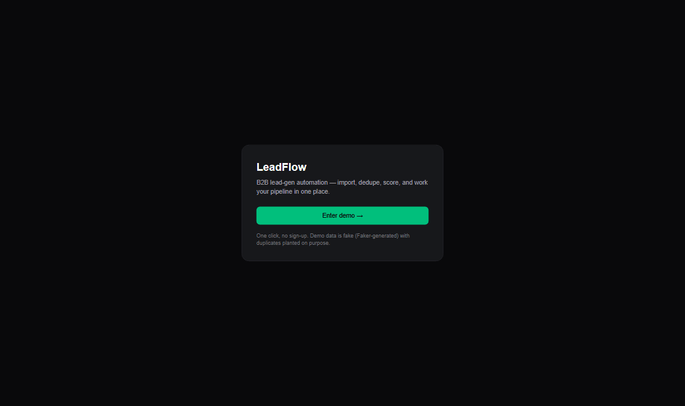
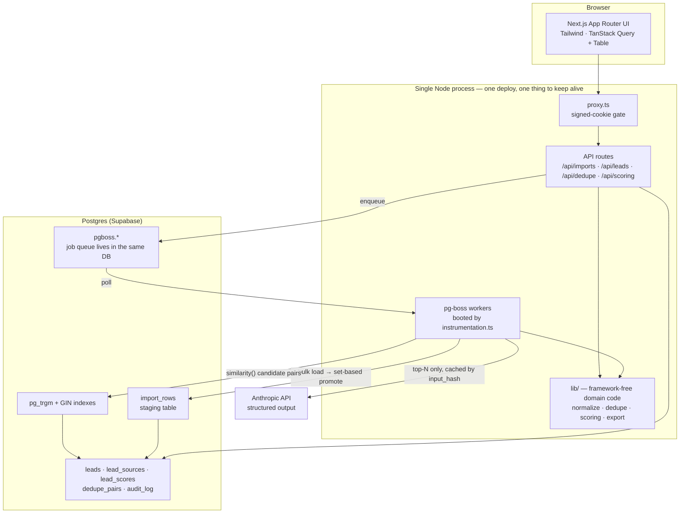

# LeadFlow

Lead-generation automation: **import messy CSVs → deduplicate → score (rules + LLM) → work the list**.

A portfolio project built to show engineering judgment, not feature count: one deep module (the dedupe engine), a disciplined LLM integration, and an honest account of everything that was deliberately cut.

**Live demo:** <!-- DEMO_URL --> _(deploying — link lands here)_ · one click to enter, no signup
**Docs:** [Project brief](PROJECT-BRIEF.md) · [Source-of-truth specs](docs/sot/) · [Decision log](docs/sot/90-decisions.md) · [Deploy runbook](docs/deploy.md)



_28 seconds, recorded against the production container image by [`scripts/record-demo.mjs`](scripts/record-demo.mjs) — the same Playwright setup the e2e tests use._

---

## What it does

| Step | What happens | Where the engineering is |
|---|---|---|
| **1. Import** | Upload a CSV (≤20MB), map columns by hand (headers are guessed, mappings saved as reusable templates), watch a progress bar | Bulk-load into a staging table, then promote with **set-based SQL** — never row-by-row through the ORM. Bad rows are flagged individually; one broken row never rejects the file |
| **2. Dedupe** | Exact duplicates collapse silently. Near-duplicates land in a review queue: "keep this one" / "not a duplicate" | Two tiers of `pg_trgm` similarity over GIN indexes, run **inside Postgres**. Every decision is remembered, so re-importing the same file never asks twice |
| **3. Score** | Rule-based score from an editable JSON config, plus an optional LLM score **with a written reason** next to it | Rules compile to SQL. The LLM runs in the background over the top-N leads only, with a content-hash cache, structured output, and retries |
| **4. Work the list** | Server-side filter/sort/pagination, funnel status changes, CSV export that respects the current filter | Export escapes formula-injection cells; every mutation writes an audit row |

---

## Architecture



**Why one process instead of a worker service:** every extra moving piece is another thing that can be down at 2am and another line on the hosting bill. `pg-boss` puts the queue in the Postgres instance the app already needs, and the workers boot in the same process as the web server. No Redis, no separate deployment. The trade-off is real and named below.

---

## The interesting part: fuzzy dedupe

Comparing every lead to every other lead is O(n²) — 10,000 leads is 50 million comparisons. Doing that in application code with a string-similarity library does not finish in a reasonable time, and no amount of clever JavaScript changes the complexity class.

The fix is to make Postgres shrink the candidate set first:

```
Tier 1:  similarity(full_name_sorted) ≥ 0.55  AND  similarity(company_normalized) ≥ 0.30
Tier 2:  similarity(full_name_sorted) ≥ 0.90  AND  similarity(company_normalized) ≥ 0.20
```

GIN trigram indexes turn the similarity predicate into an index scan, so the quadratic comparison never leaves the database and never touches most of the table. Names are normalized before matching — diacritics folded, tokens sorted — so `Nguyễn Văn An` and `AN NGUYEN VAN` collide on purpose.

Thresholds are not vibes: a [golden set of 15 hand-labelled pairs](tests/fixtures/golden-pairs.json) — duplicates, non-duplicates, and deliberately ambiguous ones — is checked into the repo and asserted against a real Postgres in CI. Changing a threshold means the golden set still has to pass. The full specification, including the merge/archive state machine and how `pair_hash` makes re-scanning idempotent, lives in [`20-dedupe-spec.md`](docs/sot/20-dedupe-spec.md).

## The other interesting part: LLM scoring that isn't a demo

Four rules the integration follows, each of which exists because ignoring it produces a bill or a bug:

- **Cached by content hash.** The cache key is a hash of the lead fields that matter, plus the ICP text, plus a prompt version. Unchanged lead, unchanged prompt → no API call. Without this, every dashboard refresh burns money.
- **Never during import.** 10k leads × one API call would blow the import budget by two orders of magnitude. Rules score everything for free; the LLM only scores the top-N by rule score, in the background, in chunks of 25.
- **Structured output, not prose parsing.** A strict tool schema forces `{ score, reason }`; the response is still re-validated and clamped defensively. Retries use exponential backoff at both the SDK and the queue level.
- **Two separate columns.** The rule score and the AI score are never blended into one number. The place where they disagree is the interesting place, and blending hides it.

Details in [`30-scoring-spec.md`](docs/sot/30-scoring-spec.md).

---

## Run it locally in 5 minutes

Requires Node 24+ and any Postgres 16 (local, Docker, Supabase, Neon).

```bash
git clone https://github.com/ducbaok/leadflow.git && cd leadflow
npm install
cp .env.example .env.local        # fill DATABASE_URL + SESSION_SECRET
npm run db:migrate                # schema + pg_trgm + GIN indexes
npm run seed                      # 5,154 demo leads with duplicates planted on purpose
npm run dev                       # → http://localhost:3000, click "Enter demo"
```

No Postgres handy? One line:

```bash
docker run -d -p 5432:5432 -e POSTGRES_PASSWORD=postgres postgres:16
```

`ANTHROPIC_API_KEY` is optional — leave it empty and rule scoring works normally while the AI job skips itself safely. Sample CSVs for the import flow are in [`public/samples/`](public/samples/): a clean file, a deliberately messy one, and a 10k-row file. To run the exact container image production runs, see [`docs/deploy.md`](docs/deploy.md).

---

## Trade-offs, and what I cut and why

Portfolio projects optimize for a different objective than products: evidence of judgment inside a viewer's five minutes, not user value. Everything below is a deliberate choice, not a backlog item I ran out of time for.

**Cut: user roles and permissions.** Owner/member split, invitations, per-role middleware — three or four days of well-understood, unsurprising code. Nobody is hired for a role-check middleware. Replaced with one-click demo auth: a signed cookie, no password, no user table.

**Cut: field-level merge.** Drawing two leads side by side with radio buttons is an afternoon of work. The hard part is the data semantics underneath, and merging forces seven decisions before a single pixel is drawn: which field wins between "FPT" and "FPT Software"; what `Won` + `Lost` collapses to; who owns the merged record; where the source rows repoint; whether cached scores survive; what "un-merge" would even mean; and how the next import knows this pair was already resolved. Shipping "keep this one, archive that one" answers four of the seven, keeps the state machine honest, and still demonstrates the whole dedupe flow. The full argument is in [the brief, §4](PROJECT-BRIEF.md).

**Cut: email sequences (SendGrid, open/click tracking, unsubscribe).** A second product bolted onto the first. Depth in one module beats breadth across five.

**Cut: undo for merges.** A merge is final. Undo is a distributed-state problem disguised as a button.

**Cut: real GDPR compliance.** See the honesty note below.

**Traded: one process instead of a worker service.** The queue workers share a process with the web server. This is the right call for a demo and for most small products — fewer things to run, fewer things to pay for, no Redis. It is the wrong call once job load and request load need to scale independently, or once a runaway job can starve HTTP handlers. Moving to a separate worker means changing the entrypoint, not the architecture: the job contracts and domain code are already framework-free.

**Traded: trigram similarity instead of a trained matcher.** Trigrams are cheap, indexable, and explainable, and they cover Vietnamese name variants well once diacritics are folded. They do not understand that the same person at two different companies is still the same person. A learned matcher would do better and would need labelled data, a training pipeline, and a story for explaining its decisions to someone staring at a review queue. The limitation is recorded as [ADR-005](docs/sot/90-decisions.md).

**Traded: Supabase's session pooler.** Prepared statements are disabled (`prepare: false`) because the pooler does not support them — a little per-query planning cost in exchange for IPv4 reachability and a free tier.

---

## Security and honesty notes

**The audit trail is preparation for GDPR, not compliance with it.** Every mutation writes to `audit_log`, which answers "who changed what, when". GDPR needs considerably more: subject access export, right to erasure, a retention policy, a lawful basis, a data processing agreement. None of that is implemented, and calling an audit table "GDPR-ready" would be a lie. It is out of scope on purpose, and this paragraph exists so nobody has to discover that by reading the code.

**CSV injection is handled.** A lead named `=HYPERLINK("https://evil.example","Click")` is a real attack: exported to CSV and opened in Excel, the formula executes. Every exported cell beginning with `=`, `+`, `-`, or `@` is prefixed with a quote. The seed data plants four such leads so the protection is visible in the demo and asserted in the test suite.

**Uploads are capped at 20MB** and streamed into a staging table rather than held in memory.

**No scraped personal data.** All demo data is Faker-generated with Vietnamese name and company patterns. Nothing was scraped from LinkedIn or anywhere else.

---

## Tests and CI

| Layer | What it covers |
|---|---|
| Unit (Vitest) | Normalization, column mapping, rule compilation, AI response parsing, export escaping, cost guards |
| Integration (real Postgres) | Golden-set dedupe (exact + fuzzy), idempotent re-import, killed-worker recovery, upload limits, audit writes |
| E2E (Playwright) | Login → import a sample CSV → see leads → score → export with escaping intact |

Every push runs all three against a live Postgres 16 service container, plus lint, typecheck, and a production build. Migrations run in CI through the same script production uses, so a broken migration fails before it can reach a deploy.

---

## Stack

Next.js 16 (App Router) · TypeScript · Drizzle ORM · Postgres 16 with `pg_trgm` · pg-boss · Tailwind · TanStack Query + Table · Anthropic SDK · Vitest · Playwright · Docker on Railway, Postgres on Supabase.

Internal specifications live under [`docs/sot/`](docs/sot/) and are authoritative over the code — this README is derived from them.
